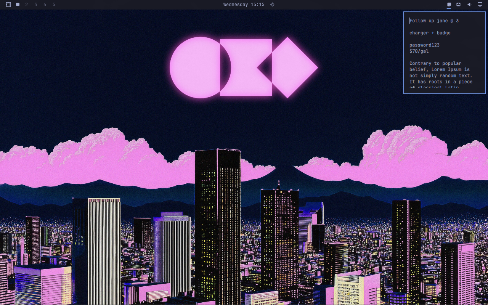

# Omanote

Omanote adds a secure multiline scratch note to the Omarchy bar and saves
changes automatically.



## Install

```bash
omarchy plugin add https://github.com/brianblakely/omanote.git --enable --yes
```

## Shortcuts

```lua
o.bind("SUPER + F8", "Toggle Omanote", "omarchy-shell shell toggle b.omanote")
o.bind("SUPER + ALT + F8", "Open Omanote", "omarchy-shell shell summon b.omanote")
o.bind("SUPER + CTRL + F8", "Close Omanote", "omarchy-shell shell hide b.omanote")
```

## Security

Notes are stored in the desktop Secret Service rather than
`~/.config/omarchy/shell.json`. Automatic saves use a randomly named file in the
user runtime directory and delete it immediately afterward.

## Update

```bash
omarchy plugin update b.omanote
```

## Uninstall

```bash
omarchy plugin remove b.omanote
```
